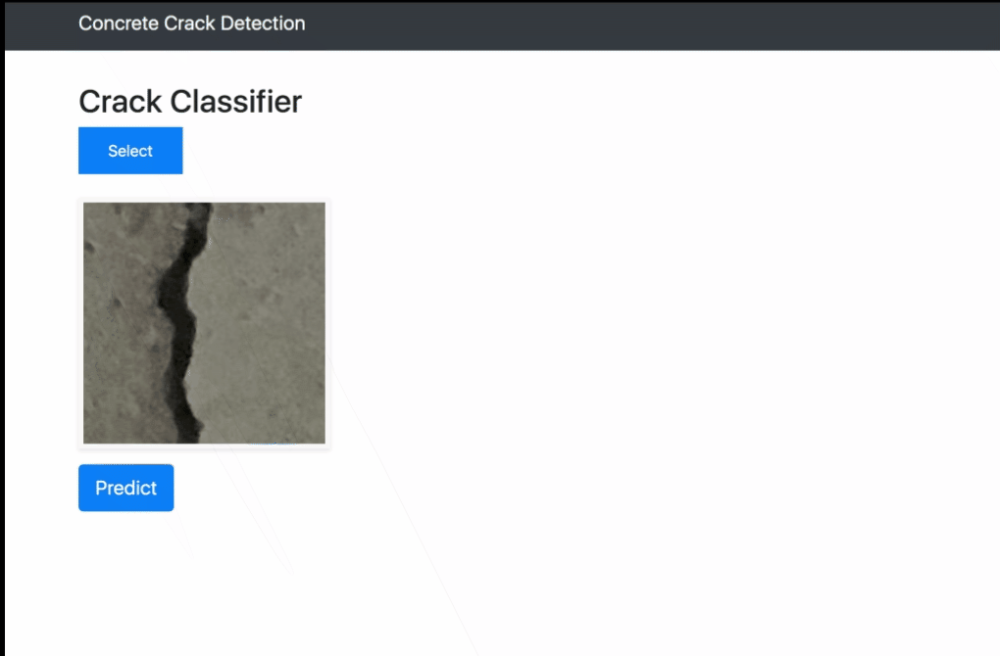

# Concrete Crack Detection For Structural Audit


## Getting Started

1) Clone Repo
    ```
    $ git clone https://github.com/viraja1/crack_detection.git
    ```
2) Change directory
    ```
    $ cd crack_detection
    ```

3) Install Requirements
    ```
    $ pip install -r requirements.txt
    ```
4) Train Model 
   
   Skip this step if you want to use pretrained model
   
   Tested with python 3.7
   ```
   $ python models/model.py
   ```
5) Run Server
   ```
   $ python app.py
   ``` 
6) Open http://127.0.0.1:8080 in browser and use the UI to test concrete crack detection

7) Try CURL requests
   ```
   $ curl -X POST -F file=@data/train/crack/15000_1.jpg http://127.0.0.1:8080/predict
   
   {"prediction":"crack"} 
   ```

## Screenshot



## Credits
* Dataset - Concrete Crack Images for Classification (https://data.mendeley.com/datasets/5y9wdsg2zt/1/)
* Deploy Keras Model with Flask as Web App
  (https://github.com/mtobeiyf/keras-flask-deploy-webapp)
* Introduction to TensorFlow for Artificial Intelligence, Machine Learning, and Deep Learning
  (https://www.coursera.org/learn/introduction-tensorflow)